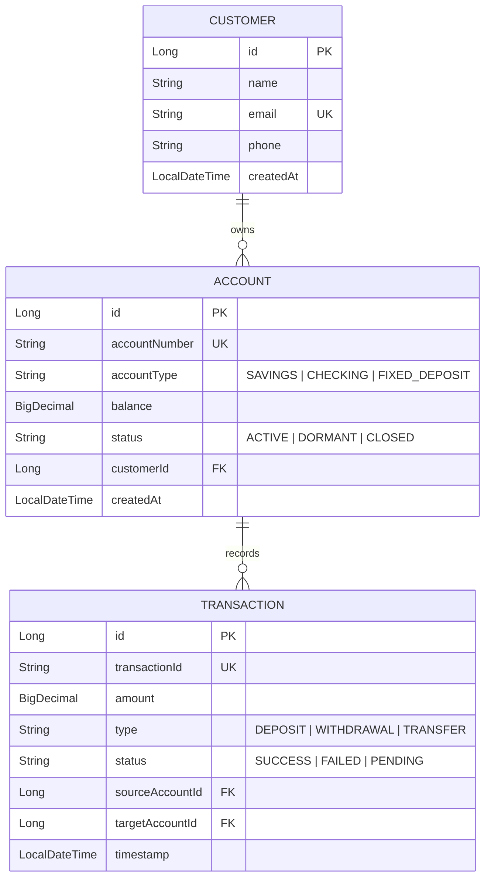
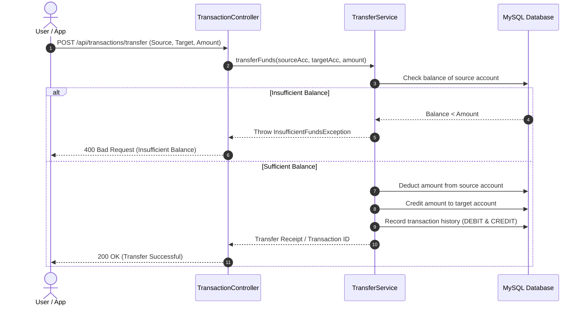

# 🏦 Banking Backend API Specification, Use Cases & Mock Data

This document provides a comprehensive guide for all API endpoints, business use cases, request/response structures, mock test datasets, and cURL commands for the **Banking Backend** service.

---

## 📑 Table of Contents
1. [General Information & Setup](#-general-information--setup)
2. [Domain Model & Entity Relationships](#-domain-model--entity-relationships)
3. [Implemented APIs: Customer Module](#-implemented-apis-customer-module)
   - [1. Create Customer](#1-create-customer)
   - [2. Get All Customers](#2-get-all-customers)
   - [3. Get Customer by ID](#3-get-customer-by-id)
   - [4. Update Customer](#4-update-customer)
   - [5. Delete Customer](#5-delete-customer)
4. [Banking Business Use Cases & Flows](#-banking-business-use-cases--flows)
5. [Roadmap Banking APIs (Accounts & Transactions)](#-roadmap-banking-apis-accounts--transactions)
   - [Account Management APIs](#account-management-apis)
   - [Transaction & Money Transfer APIs](#transaction--money-transfer-apis)
6. [Ready-to-Use Mock Datasets (JSON)](#-ready-to-use-mock-datasets-json)
7. [Direct Database Seed Script (SQL)](#-direct-database-seed-script-sql)

---

## 🌐 General Information & Setup

| Property | Value |
| :--- | :--- |
| **Base URL** | `http://localhost:8080` |
| **Default Content-Type** | `application/json` |
| **Database** | MySQL 8.0 (`banking_db` on `localhost:3306`) |
| **Authentication (Initial)** | Open / Public (Spring Security integration planned) |

---

## 🏛️ Domain Model & Entity Relationships



---

## 👥 Implemented APIs: Customer Module

### 1. Create Customer

* **Use Case**: Onboard a new bank customer and create their user profile.
* **HTTP Method**: `POST`
* **Endpoint**: `/api/customers`
* **Headers**: `Content-Type: application/json`

#### Request Body
```json
{
  "name": "Rajeev Ranjan",
  "email": "rajeev.ranjan@example.com",
  "phone": "+91-9876543210"
}
```

#### Response Body (`200 OK` / `201 Created`)
```json
{
  "id": 1,
  "name": "Rajeev Ranjan",
  "email": "rajeev.ranjan@example.com",
  "phone": "+91-9876543210",
  "createdAt": "2026-09-04T17:30:00"
}
```

#### cURL Command
```bash
curl -X POST http://localhost:8080/api/customers \
  -H "Content-Type: application/json" \
  -d '{
    "name": "Rajeev Ranjan",
    "email": "rajeev.ranjan@example.com",
    "phone": "+91-9876543210"
  }'
```

---

### 2. Get All Customers

* **Use Case**: Admin view to list all registered customers.
* **HTTP Method**: `GET`
* **Endpoint**: `/api/customers`

#### Response Body (`200 OK`)
```json
[
  {
    "id": 1,
    "name": "Rajeev Ranjan",
    "email": "rajeev.ranjan@example.com",
    "phone": "+91-9876543210",
    "createdAt": "2026-09-04T17:30:00"
  },
  {
    "id": 2,
    "name": "Abhay Sharma",
    "email": "abhay.sharma@example.com",
    "phone": "+91-9811223344",
    "createdAt": "2026-09-04T17:35:00"
  },
  {
    "id": 3,
    "name": "Priya Patel",
    "email": "priya.patel@example.com",
    "phone": "+91-9822334455",
    "createdAt": "2026-09-04T17:40:00"
  }
]
```

#### cURL Command
```bash
curl -X GET http://localhost:8080/api/customers
```

---

### 3. Get Customer by ID

* **Use Case**: Retrieve profile details of a specific customer by their ID.
* **HTTP Method**: `GET`
* **Endpoint**: `/api/customers/{id}`

#### URL Parameters
* `id` *(Long)*: Unique Customer ID (e.g., `1`)

#### Response Body (`200 OK`)
```json
{
  "id": 1,
  "name": "Rajeev Ranjan",
  "email": "rajeev.ranjan@example.com",
  "phone": "+91-9876543210",
  "createdAt": "2026-09-04T17:30:00"
}
```

#### Not Found Response (`404 Not Found` or `null`)
```json
null
```

#### cURL Command
```bash
curl -X GET http://localhost:8080/api/customers/1
```

---

### 4. Update Customer

* **Use Case**: Customer updates their contact details (name, email, or phone number).
* **HTTP Method**: `PUT`
* **Endpoint**: `/api/customers/{id}`
* **Headers**: `Content-Type: application/json`

#### Request Body
```json
{
  "name": "Rajeev K. Ranjan",
  "email": "rajeev.k.ranjan@example.com",
  "phone": "+91-9999888877"
}
```

#### Response Body (`200 OK`)
```json
{
  "id": 1,
  "name": "Rajeev K. Ranjan",
  "email": "rajeev.k.ranjan@example.com",
  "phone": "+91-9999888877",
  "createdAt": "2026-09-04T17:30:00"
}
```

#### cURL Command
```bash
curl -X PUT http://localhost:8080/api/customers/1 \
  -H "Content-Type: application/json" \
  -d '{
    "name": "Rajeev K. Ranjan",
    "email": "rajeev.k.ranjan@example.com",
    "phone": "+91-9999888877"
  }'
```

---

### 5. Delete Customer

* **Use Case**: Remove a customer profile from the system.
* **HTTP Method**: `DELETE`
* **Endpoint**: `/api/customers/{id}`

#### Response Body (`200 OK` / `204 No Content`)

#### cURL Command
```bash
curl -X DELETE http://localhost:8080/api/customers/1
```

---

## 💼 Banking Business Use Cases & Flows

### Use Case 1: New Customer Onboarding & Account Creation
1. Bank branch/app submits `POST /api/customers` with customer details.
2. Backend assigns a `customerId` and persists in `customers` table.
3. Once verified, a bank account (Savings/Checking) is opened for that customer.

### Use Case 2: Fund Transfer Between Accounts


---

## 🚀 Roadmap Banking APIs (Accounts & Transactions)

These are the standard banking endpoints planned for next phases:

### Account Management APIs

| Method | Endpoint | Description |
| :--- | :--- | :--- |
| `POST` | `/api/accounts` | Create a new Savings/Checking account for a customer |
| `GET` | `/api/accounts/{id}` | Get account details by Account ID |
| `GET` | `/api/customers/{customerId}/accounts` | Get all accounts owned by a customer |
| `GET` | `/api/accounts/{id}/balance` | Check current account balance |

#### Mock Payload: Create Account (`POST /api/accounts`)
```json
{
  "customerId": 1,
  "accountType": "SAVINGS",
  "initialDeposit": 5000.00
}
```

#### Mock Response:
```json
{
  "accountId": 101,
  "accountNumber": "ACC-98234812",
  "accountType": "SAVINGS",
  "balance": 5000.00,
  "status": "ACTIVE",
  "customerId": 1,
  "createdAt": "2026-09-04T17:45:00"
}
```

---

### Transaction & Money Transfer APIs

| Method | Endpoint | Description |
| :--- | :--- | :--- |
| `POST` | `/api/accounts/{id}/deposit` | Deposit funds into an account |
| `POST` | `/api/accounts/{id}/withdraw` | Withdraw funds from an account |
| `POST` | `/api/transactions/transfer` | Transfer funds between two accounts |
| `GET` | `/api/accounts/{id}/transactions` | View transaction history / bank statement |

#### Mock Payload: Deposit Money (`POST /api/accounts/101/deposit`)
```json
{
  "amount": 2500.00,
  "description": "Salary deposit"
}
```

#### Mock Payload: Fund Transfer (`POST /api/transactions/transfer`)
```json
{
  "sourceAccountNumber": "ACC-98234812",
  "targetAccountNumber": "ACC-45981230",
  "amount": 1200.00,
  "remarks": "Rent payment"
}
```

#### Mock Response: Fund Transfer (`200 OK`)
```json
{
  "transactionId": "TXN-20260904-892147",
  "sourceAccountNumber": "ACC-98234812",
  "targetAccountNumber": "ACC-45981230",
  "amount": 1200.00,
  "status": "SUCCESS",
  "timestamp": "2026-09-04T17:48:22",
  "remarks": "Rent payment"
}
```

---

## 📦 Ready-to-Use Mock Datasets (JSON)

Use these realistic mock objects for testing via Postman, Thunder Client, or cURL.

### Dataset 1: Customer Profiles
```json
[
  {
    "name": "Aarav Gupta",
    "email": "aarav.gupta@example.com",
    "phone": "+91-9876512340"
  },
  {
    "name": "Sneha Reddy",
    "email": "sneha.reddy@example.com",
    "phone": "+91-9823456781"
  },
  {
    "name": "Rohan Deshmukh",
    "email": "rohan.d@example.com",
    "phone": "+91-9765432109"
  },
  {
    "name": "Ananya Verma",
    "email": "ananya.v@example.com",
    "phone": "+91-9988776655"
  },
  {
    "name": "Vikram Singh",
    "email": "vikram.singh@example.com",
    "phone": "+91-9123456780"
  }
]
```

---

## 🗄️ Direct Database Seed Script (SQL)

If you wish to pre-populate the database directly via MySQL client:

```sql
USE banking_db;

-- Clear existing data (optional)
-- DELETE FROM customers;

INSERT INTO customers (name, email, phone, created_at) VALUES
('Rajeev Ranjan', 'rajeev.ranjan@example.com', '+91-9876543210', NOW()),
('Abhay Sharma', 'abhay.sharma@example.com', '+91-9811223344', NOW()),
('Priya Patel', 'priya.patel@example.com', '+91-9822334455', NOW()),
('Aarav Gupta', 'aarav.gupta@example.com', '+91-9876512340', NOW()),
('Sneha Reddy', 'sneha.reddy@example.com', '+91-9823456781', NOW());

-- Verify inserted data
SELECT * FROM customers;
```
